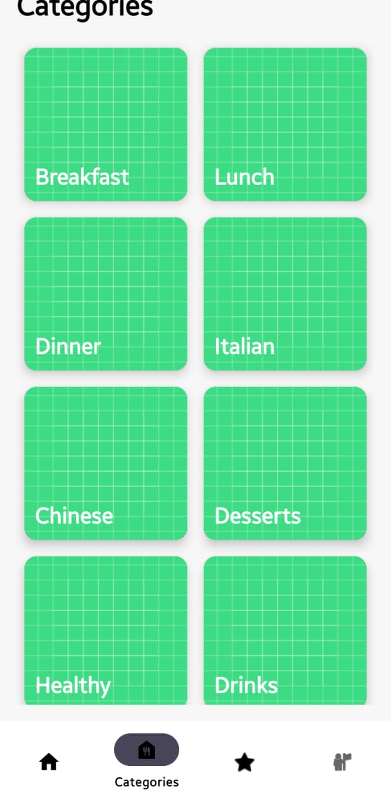

## 📂 Project Structure
<h1 align="center">🍲 Recipe App</h1>

Modern Android Recipe Application

---

## 📱 About The Project

Recipe App is a modern Android application where users can browse recipes, check cooking time, and add their favorite recipes.

This project was developed as an Android Mini Project to demonstrate Android development concepts including RecyclerView, Fragments, and clean UI design.

---

## ✨ Features

🍲 Browse different recipes  
⏱ View cooking time  
❤️ Add recipes to Favorites  
📖 View recipe details  
👤 User profile screen  
📱 Clean and simple UI  

---

## 🛠 Tech Stack

| Technology | Use |
|------------|------|
| Java | Application Logic |
| XML | UI Design |
| RecyclerView | Recipe List |
| Fragments | Screen Navigation |
| Android Studio | Development |

Developed using **Android Studio**

---

## 📸 App Screenshots

---

## 📂 Project StructureRecipeApp
┣ app
┣ java
┣ res
┃ ┣ layout
┃ ┣ drawable
┃ ┗ values
┣ Gradle Files

---

## 👨‍💻 Developer

BHADRESH KASHIYANI(6TH SEM B.TECH IT)

---

## ⭐ Learning Outcomes

This project helped in learning:

- Android UI Design
- RecyclerView Implementation
- Fragment Navigation
- Android App Development Workflow
- GitHub Project Management

---

⭐ If you like this project please give it a star!

